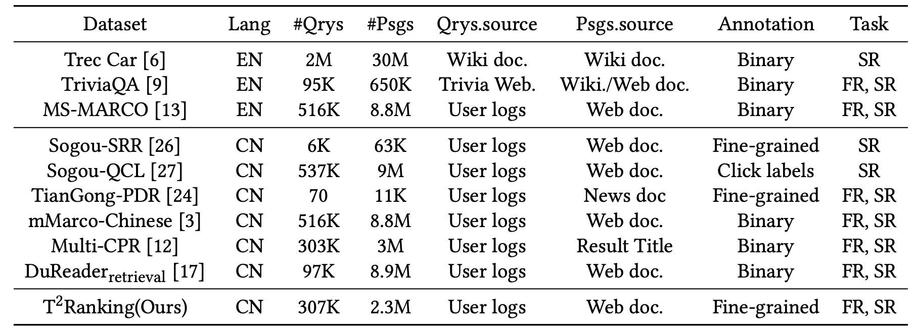

# T<sup>2</sup>Ranking

## Introduction
T<sup>2</sup>Ranking is a large-scale Chinese benchmark for passage ranking. The details about T<sup>2</sup>Ranking are elaborated in [this paper](https://arxiv.org/abs/2304.03679#).


Passage ranking are important and challenging topics for both academics and industries in the area of Information Retrieval (IR). The goal of passage ranking is to compile a search result list ordered in terms of relevance to the query from a large passage collection. Typically, Passage ranking involves two stages: passage retrieval and passage re-ranking. 

To support the passage ranking research, various benchmark datasets are constructed. However, the commonly-used datasets for passage ranking usually focus on the English language. For non-English scenarios, such as Chinese, the existing datasets are limited in terms of data scale, fine-grained relevance annotation and false negative issues.


To address this problem, we introduce T<sup>2</sup>Ranking, a large-scale Chinese benchmark for passage ranking. T<sup>2</sup>Ranking comprises more than 300K queries and over 2M unique passages from real- world search engines. Specifically, we sample question-based search queries from user logs of the Sogou search engine, a popular search system in China. For each query, we extract the content of corresponding documents from different search engines. After model-based passage segmentation and clustering-based passage de-duplication, a large-scale passage corpus is obtained. For a given query and its corresponding passages, we hire expert annotators to provide 4-level relevance judgments of each query-passage pair. 


<div align=center></div>
<div align=center>Table 1: The data statistics of datasets commonly used in passage ranking. FR(SR): First (Second)- stage of passage ranking, i.e., passage Retrieval (Re-ranking).</div>


Compared with existing datasets, T<sup>2</sup>Ranking dataset has the following characteristics and advantages:
* The proposed dataset focus on the Chinese search scenario, and has advantages in data scale compared with existing Chinese passage ranking datasets, which can better support the design of deep learning algorithms
* The proposed dataset has a large number of fine-grained relevance annotations, which is helpful for mining fine-grained relationship between queries and passages and constructing more accurate ranking algorithms.
* By retrieving passage results from multiple commercial search engines and providing complete annotation, we ease the false negative problem to some extent, which is beneficial to providing more accurate evaluation.
* We design multiple strategies to ensure the high quality of our dataset, such as using a passage segment model and a passage clustering model to enhance the semantic integrity and diversity of passages and employing active learning for annotation method to improve the efficiency and quality of data annotation.

## Data Download
The whole dataset is placed in [huggingface](https://huggingface.co/datasets/THUIR/T2Ranking), and the data formats are presented in the following table.
<div class="center">

| Description| Filename|Num Records|Format|
|-------------------------------------------------------|-------------------------------------------------------------------------------------------------------------------------|----------:|-----------------------------------:|
| Collection                                | collection.tsv                             |                           2,303,643  | tsv: pid, passage |
| Queries     Train                          | queries.train.tsv                                 |                  258,042  | tsv: qid, query |
| Queries     Dev                          | queries.dev.tsv                                 |                 24,832  | tsv: qid, query |
| Queries     Test                          | queries.test.tsv                                 |                24,832  | tsv: qid, query |
| Qrels Train for re-ranking                             | qrels.train.tsv                                 |             1,613,421  | TREC qrels format |
| Qrels Dev for re-ranking          | qrels.dev.tsv                                    |      400,536    | TREC qrels format |
| Qrels Retrieval Train                               | qrels.retrieval.train.tsv                                |            744,663  | tsv: qid, pid |
| Qrels Retrieval Dev                               | qrels.retrieval.dev.tsv                                |            118,933  | tsv: qid, pid |
|  BM25 Negatives                               | train.bm25.tsv                                |            200,359,731  | tsv: qid, pid, index |
|  Hard Negatives                               | train.mined.tsv                                |            200,376,001  | tsv: qid, pid, index, score |

</div>

You can download the dataset by running the following command:
```bash
git lfs install
git clone https://huggingface.co/datasets/THUIR/T2Ranking
```
After downloading, you can find the following files in the folder:
```
├── data
│   ├── collection.tsv
│   ├── qrels.dev.tsv
│   ├── qrels.retrieval.dev.tsv
│   ├── qrels.retrieval.train.tsv
│   ├── qrels.train.tsv
│   ├── queries.dev.tsv
│   ├── queries.test.tsv
│   ├── queries.train.tsv
│   ├── train.bm25.tsv
│   └── train.mined.tsv
├── script
│   ├── train_cross_encoder.sh
│   └── train_dual_encoder.sh
└── src
    ├── convert2trec.py
    ├── dataset_factory.py
    ├── modeling.py
    ├── msmarco_eval.py
    ├── train_cross_encoder.py
    ├── train_dual_encoder.py
    └── utils.py
```


## Training and Evaluation
The dual-encoder can be trained by running the following command:
```bash
sh script/train_dual_encoder.sh
```
After training the model, you can evaluate the model by running the following command:
```bash
python src/msmarco_eval.py data/qrels.retrieval.dev.tsv output/res.top1000.step20
```


The cross-encoder can be trained by running the following command:
```bash
sh script/train_cross_encoder.sh
```
After training the model, you can evaluate the model by running the following command:
```bash
python src/convert2trec.py output/res.step-20 && python src/msmarco_eval.py data/qrels.retrieval.dev.tsv output/res.step-20.trec && path_to/trec_eval -m ndcg_cut.5 data/qrels.dev.tsv res.step-20.trec
```

We have uploaded some checkpoints to Huggingface Hub.

| Model              | Description                                               | Link                                                         |
| ------------------ | --------------------------------------------------------- | ------------------------------------------------------------ |
| dual-encoder 1     | dual-encoder trained with bm25 negatives             | [DE1](https://huggingface.co/datasets/THUIR/T2Ranking/blob/main/data/dual-encoder-trained-without-hard-negatives.p)    |
| dual-encoder 2     | dual-encoder trained with self-mined hard negatives  | [DE2](https://huggingface.co/datasets/THUIR/T2Ranking/blob/main/data/dual-encoder-trained-with-hard-negatives.p) |
| cross-encoder      | cross-encoder trained with self-mined hard negatives | [CE](https://huggingface.co/datasets/THUIR/T2Ranking/blob/main/data/cross-encoder.p)                     |


BM25 on DEV set
```bash
#####################
MRR @10: 0.35894801237316354
QueriesRanked: 24831
recall@1: 0.05098711868967141
recall@1000: 0.7464097131133757
recall@50: 0.4942572226146033
#####################
```

DPR with BM25 negatives on DEV set

```bash
#####################
MRR @10: 0.4856112079562753
QueriesRanked: 24831
recall@1: 0.07367235058688999
recall@1000: 0.9082753169878586
recall@50: 0.7099350889583964
#####################
```

DPR trained with self-mined hard negatives on DEV set

```bash
#####################
MRR @10: 0.5166915171959451
QueriesRanked: 24831
recall@1: 0.08047455688965123
recall@1000: 0.9135220125786163
recall@50: 0.7327044025157232
#####################
```


BM25 retrieved+CE reranked on DEV set

The reranked run file is placed in [here.](https://huggingface.co/datasets/THUIR/T2Ranking/blob/main/data/dev.bm25.tsv)
```bash
#####################
MRR @10: 0.5188107959009376
QueriesRanked: 24831
recall@1: 0.08545219116806242
recall@1000: 0.7464097131133757
recall@50: 0.595298153566744
#####################
ndcg_cut_20             all     0.4405
ndcg_cut_100            all     0.4705
#####################
```

DPR retrieved+CE reranked on DEV set

The reranked run file is placed in [here.](https://huggingface.co/datasets/THUIR/T2Ranking/blob/main/data/dev.dpr.tsv)
```bash
#####################
MRR @10: 0.5508822816845231
QueriesRanked: 24831
recall@1: 0.08903406988867588
recall@1000: 0.9135220125786163
recall@50: 0.7393720781623112
#####################
ndcg_cut_20             all     0.5131
ndcg_cut_100            all     0.5564
#####################
```

## License
The dataset is licensed under the [Apache License 2.0](https://www.apache.org/licenses/LICENSE-2.0.html).


## Citation
If you use this dataset in your research, please cite our paper:
```
@misc{xie2023t2ranking,
      title={T2Ranking: A large-scale Chinese Benchmark for Passage Ranking}, 
      author={Xiaohui Xie and Qian Dong and Bingning Wang and Feiyang Lv and Ting Yao and Weinan Gan and Zhijing Wu and Xiangsheng Li and Haitao Li and Yiqun Liu and Jin Ma},
      year={2023},
      eprint={2304.03679},
      archivePrefix={arXiv},
      primaryClass={cs.IR}
}
```
